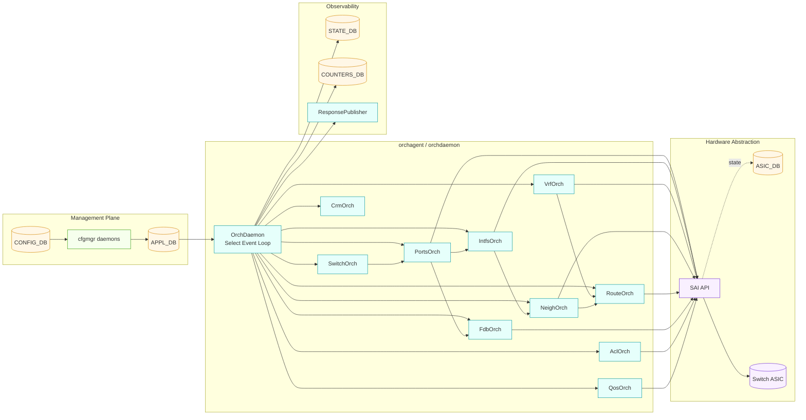

```mermaid
flowchart LR
	subgraph Mgmt[Management Plane]
		CDB[(CONFIG_DB)]
		CFG[cfgmgr daemons]
		ADB[(APPL_DB)]
	end

	subgraph Orch[orchagent / orchdaemon]
		OD[OrchDaemon\nSelect Event Loop]
		SW[SwitchOrch]
		PT[PortsOrch]
		IF[IntfsOrch]
		VR[VrfOrch]
		NH[NeighOrch]
		RT[RouteOrch]
		FD[FdbOrch]
		AC[AclOrch]
		QO[QosOrch]
		CRM[CrmOrch]
	end

	subgraph Obs[Observability]
		SDB[(STATE_DB)]
		CNT[(COUNTERS_DB)]
		RP[ResponsePublisher]
	end

	subgraph Hw[Hardware Abstraction]
		SAI[SAI API]
		ASIC[(ASIC_DB)]
		CHIP[(Switch ASIC)]
	end

	CDB --> CFG --> ADB --> OD

	OD --> SW
	OD --> PT
	OD --> IF
	OD --> VR
	OD --> NH
	OD --> RT
	OD --> FD
	OD --> AC
	OD --> QO
	OD --> CRM

	SW --> PT
	PT --> IF
	PT --> FD
	IF --> NH
	VR --> RT
	NH --> RT

	PT --> SAI
	IF --> SAI
	VR --> SAI
	NH --> SAI
	RT --> SAI
	FD --> SAI
	AC --> SAI
	QO --> SAI

	SAI --> CHIP
	SAI -. state .-> ASIC

	OD --> RP
	OD --> SDB
	OD --> CNT

	classDef db fill:#fff7e6,stroke:#d48806,stroke-width:1px
	classDef orch fill:#e6fffb,stroke:#08979c,stroke-width:1px
	classDef hw fill:#f9f0ff,stroke:#722ed1,stroke-width:1px
	classDef ctl fill:#f6ffed,stroke:#389e0d,stroke-width:1px

	class CDB,ADB,SDB,CNT,ASIC db
	class OD,SW,PT,IF,VR,NH,RT,FD,AC,QO,CRM,RP orch
	class SAI,CHIP hw
	class CFG ctl
```
