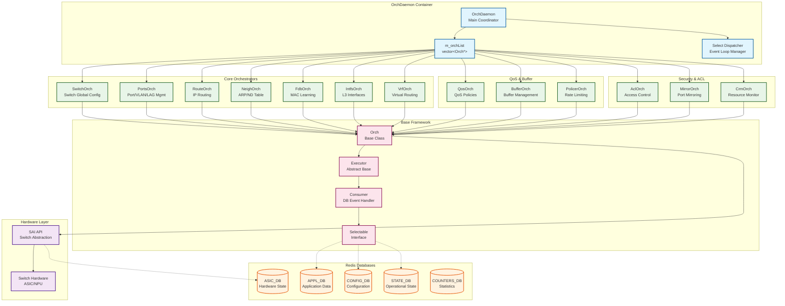
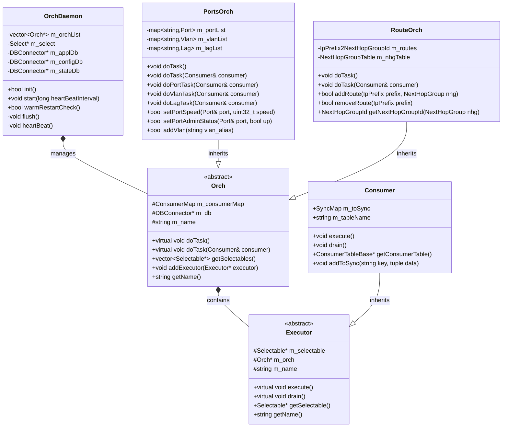
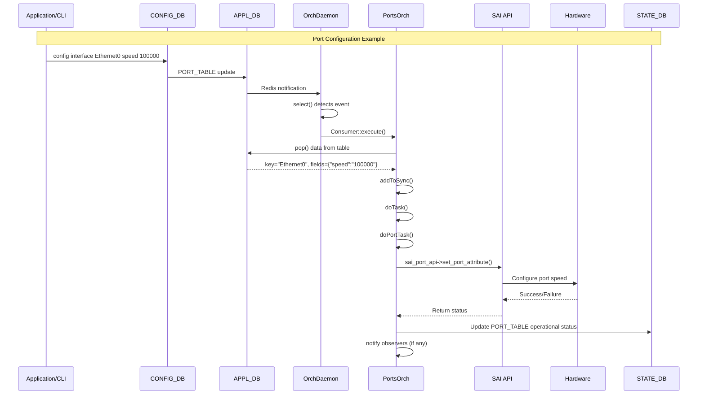
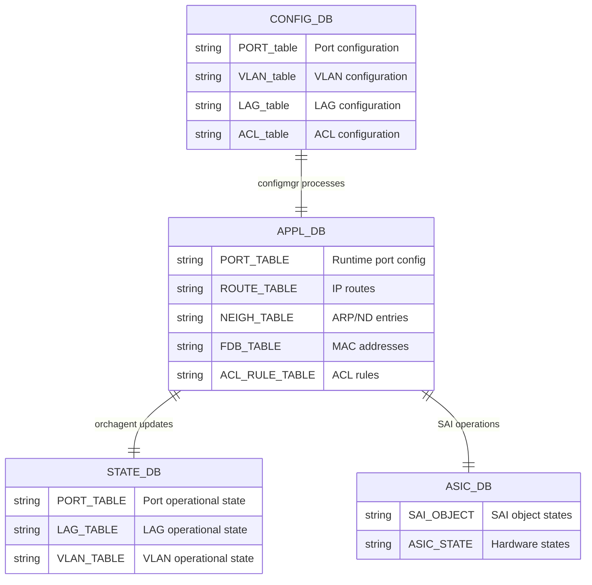

# SONiC SWSS Architecture

## Tài liệu liên quan

- Thiết kế chi tiết OrchAgent và các Orch liên quan: `doc/orchagent-detailed-design.md`

## Overview
Tài liệu này mô tả kiến trúc của SONiC Switch State Service (SWSS).

## Main Architecture Diagram

## Class Hierarchy

## Event Processing Flow

## Database Schema Integration

